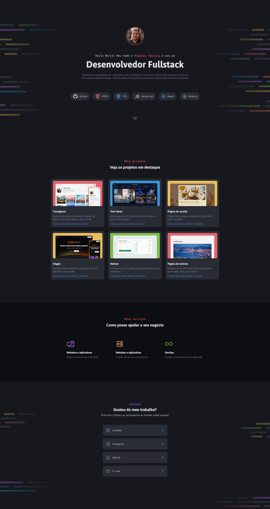

# Portfólio Dev – Wladimir

<p align="center">
  
</p>

---

Este repositório contém um portfólio profissional desenvolvido em HTML e CSS puro, com foco em responsividade, organização visual e boas práticas de front-end. O objetivo é apresentar projetos, serviços e formas de contato de maneira clara, moderna e acessível.

## Principais características do projeto

- **Site estático**: Não utiliza frameworks ou pré-processadores. Todo o código é HTML e CSS puro.
- **Componentização por seções**: Estrutura dividida em seções (`intro`, `projects`, `services`, `contact`), facilitando manutenção e expansão.
- **Design responsivo**: Layout adaptável a diferentes tamanhos de tela, com uso de flexbox e grid.
- **Tipografia e cores consistentes**: Utilização de classes utilitárias e variáveis CSS para padronização visual.
- **Ícones modernos**: Integração com Phosphor Icons via CDN.
- **Exemplos de projetos reais**: Cards de projetos com imagens, descrições e links externos.
- **Fácil customização**: Estrutura e estilos organizados para facilitar adição de novos projetos, serviços ou ajustes visuais.

## Estrutura do projeto

- `index.html` – Estrutura principal do site
- `globals.css` – Variáveis, resets e regras globais de tipografia
- `style.css` – Estilos por seção e componentes (cards, containers, links)
- `assets/` – Imagens e ícones utilizados no site

## Como visualizar localmente

1. Clone este repositório:
   ```bash
   git clone git@github.com:wladimirbatista/Portifolio-Dev--Wladimir.git
   ```
2. Abra o arquivo `index.html` diretamente no navegador
   - **Ou** utilize uma extensão como Live Server no VS Code para recarregamento automático

## Observações importantes

- Todos os links externos abrem em nova aba (`target="_blank"`).
- Os caminhos de imagens são relativos e sensíveis a maiúsculas/minúsculas em ambientes Unix (atenção ao fazer deploy).
- Não há dependências externas além do CDN de ícones.

## Contato

Para sugestões, dúvidas ou propostas, utilize as redes sociais listadas na seção de contato do site.

---

Sinta-se à vontade para contribuir, sugerir melhorias ou utilizar este projeto como base para seu próprio portfólio!
